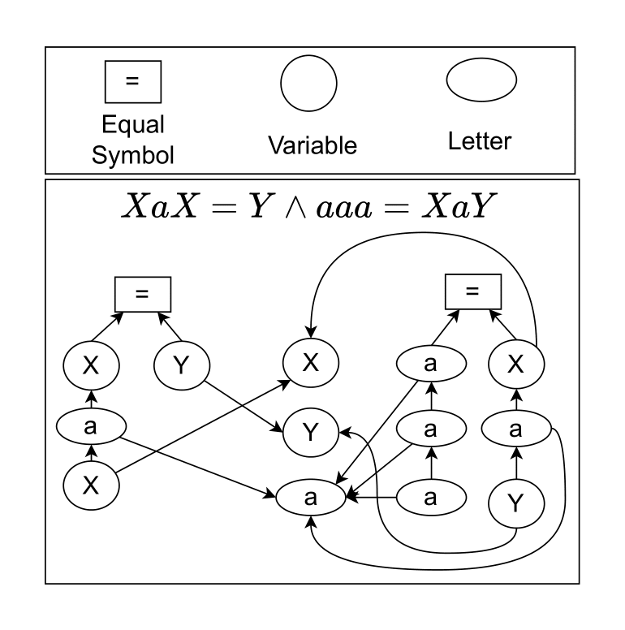
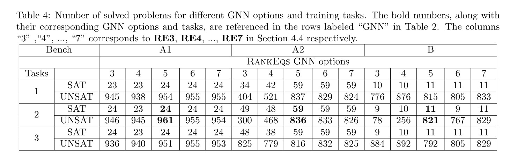

## Ablation Study

For simplicity, we also call a set of conjunctive word equations *a word equation system*.

### Word Equation Graph Encoding

Before proposing the word equation graph encoding with global information (see **Figure 2** in the paper), we initially adopted the graph encoding method introduced in [reference]. However, this approach yielded low accuracy during training and did not improve solver performance when the trained model was integrated.

We then explored encoding the entire word equation system as a single graph, as illustrated in **Figure 3**. Several variations were tested, including adding abstract nodes to aggregate all word equations and modifying edge directions. However, these changes did not enhance the final performance in terms of newly solved problems. Difficult instances often involve a large number of equations, making the graph too large and computationally expensive for encoding and GNNs to process. This significantly slows down the solver.

In contrast, using an encoding that represents individual word equations while sharing global information (Figure 2 in the paper) allows the solver to cache GNN embeddings of unchanged equations during the search. This caching mechanism greatly improves overall efficiency. Such caching is not possible in the design where the entire equation system is encoded as one graph (Figure 3), leading to inferior performance.

**Figure 3:**

> *Encode the conjunctive word equations XaX = Y ∧ aaa = XaY as one graph where X, Y are variables and a is a letter.*

---

### Training Data Collection

As described in Section 4.1, we mention only two sources of training data. However, our initial data collection included four sources:

1. Shortest paths from SAT and UNSAT problems solved by our solver.
2. MUSes extracted by our solver.
3. MUSes provided by other solvers.
4. Shortest paths from UNSAT problems solved by our solver, guided by MUSes from other solvers.

We experimented with all combinations of these sources and ultimately reported only the most effective one inSection 4.1. The best-performing combination includes MUSes from other solvers and shortest paths from UNSAT problems solved by our solver guided by these MUSes.

---

### GNN Model

We experimented with various GNN architectures, including **GCN**, **Graph Attention Networks (GAT)** [Velickovic et al., 2018], and **Graph Isomorphism Network (GIN)** [Xu et al., 2019]. Variants were also tested, such as changing the node aggregation function from mean to max or min. Additionally, we explored combining multiple GNNs by feeding the same input graph into different models, concatenating their outputs, and passing the result to a classifier.

In some cases, particularly when the word equations are long, GAT achieved slightly better validation accuracy during training, with an improvement of about two percentage points. However, when integrating the trained models into the solver, the number of solved problems remained similar to that of GCN.

We attribute this to the higher computational cost of GNNs like GAT and GIN. Although they may offer marginally better performance during training, the gain has limited impact on the final evaluation due to runtime constraints.

This observation held across all tested GNNs and their variants: **none outperformed GCN** in terms of the number of solved problems. Therefore, we report only the results using GCN in our paper.

---

### Ranking Options

We tested several hand-crafted ranking options, including ordering equations by size in both ascending and descending order.  
Across most benchmarks, these heuristics performed no better—and often worse—than a random order. Consequently, we report only the two simplest baselines: the **predefined order** (which saves reordering time) and the **random order**.

---

### Experimental Results for Tasks and Integrating Options

**Table 4** presents the number of solved **SAT** and **UNSAT** problems across different training tasks and GNN options for implementing `RankEqs`. **Benchmark C** is excluded from evaluation because the ranking process has no significant impact on performance when non-linearity is high, resulting in insufficient data to train the GNN models.

The differences in the number of solved **SAT** problems across various configurations are relatively small. This can be attributed to two primary reasons:

1. If each conjunct in a conjunctive formula is independent, the ordering would not impact the outcome for **SAT** problems, as all conjuncts must independently satisfy the formula.
2. Conjuncts in conjunctive word equations are usually not fully independent, as they often share variables. Consequently, the sequence in which the conjuncts are processed influences the solving time for **SAT** problems.

Conversely, for **UNSAT** problems, the sequence of the conjuncts affects performance more, regardless of the independence of individual conjuncts.

Therefore, the following discussion primarily focuses on the **UNSAT** problems.

---

#### Computational Overhead of Training Tasks

The computational overhead follows the order:  
**Task 2 > Task 1 > Task 3**

- **Task 2**: This task first computes the graph representation for each word equation, \( H_{G_i} \), and then aggregates these into a global feature representation using  
  \( H_G = \sum (H_{G_1}, \dots, H_{G_n}) \).  
  To compute the ranking score of each conjunct, forward propagation must be performed \( n \) times with the concatenated input \( H_{G_i} \| H_G \) for each GNN layer.

- **Task 1**: This task requires forward propagation \( n \) times using the individual graph representations \( H_{G_i} \), but it does not involve computing or concatenating the global feature representation \( H_G \).

- **Task 3**: This task only requires a single forward propagation step using the set of individual graph representations  
  \( (H_{G_1}, \dots, H_{G_n}) \).

The numbers of solved **UNSAT** problems in columns **RE3** and **RE4** for Benchmarks A2 and B support these observations.  
For Benchmark A1, it is not sensitive to GNN call overhead because the overall number of iterations required to solve the problems is low.

---

#### GNN Option Comparisons

- **RE3** involves the most calls to the GNN model. It is generally outperformed by other options across all tasks and benchmarks due to its overhead.

- **RE4** introduces a random process. Its performance is below average for Benchmarks A1 and A2 because it disrupts GNN predictions.  
  However, in **Benchmark B**, it achieves the best performance for **Tasks 1 and 3**. This is because Benchmark B is non-linear; repeatedly applying inference rules to the same non-linear equation can increase its length and potentially cause non-termination.  
  The randomness helps escape such situations.  
  However, for Task 3, the GNN overhead reduces this advantage.

- **RE5** has the least overhead from GNN model calls. For Benchmarks A1 and A2, it outperforms most other options. For Benchmark B, it performs at an average level.

- **RE6** and **RE7** maintain high performance across all benchmarks but do not consistently outperform **RE5**.

---

<!-- Insert Table 4 here -->

