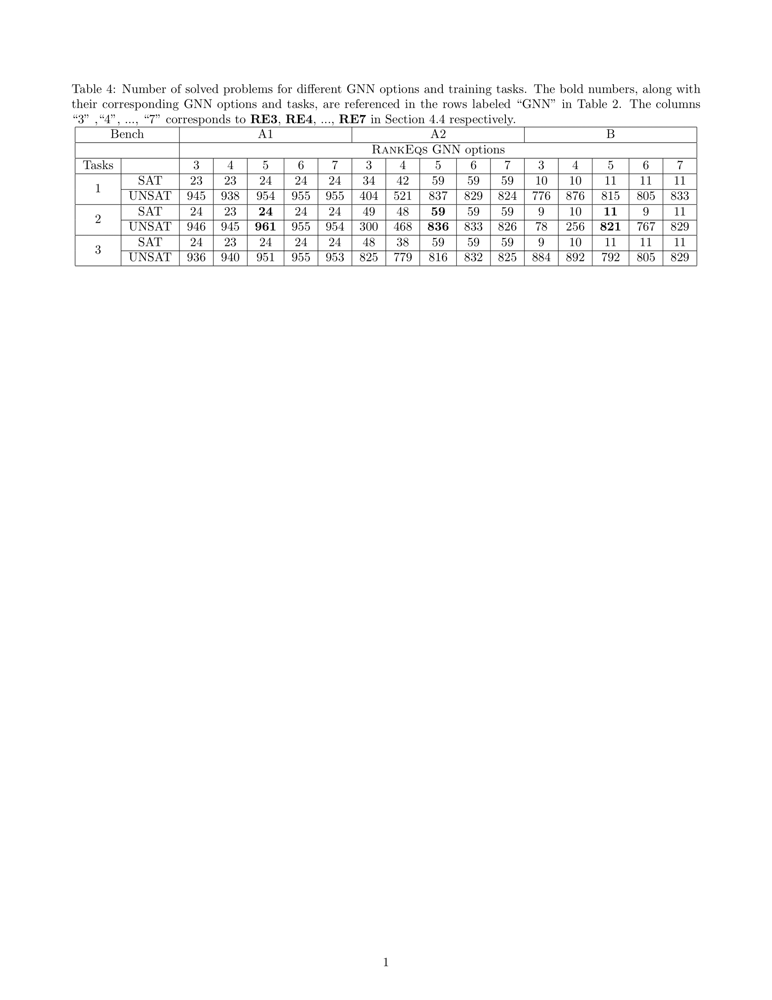

## Ablation Study

For simplicity, we also call a set of conjunctive word equations *a word equation system*.

### Word Equation Graph Encoding

Before proposing the word equation graph encoding with global information (see **Figure 2** in the paper), we initially adopted the graph encoding method introduced in [reference]. However, this approach yielded low accuracy during training and did not improve solver performance when the trained model was integrated.

We then explored encoding the entire word equation system as a single graph, as illustrated in **Figure 3**. Several variations were tested, including adding abstract nodes to aggregate all word equations and modifying edge directions. However, these changes did not enhance the final performance in terms of newly solved problems. Difficult instances often involve a large number of equations, making the graph too large and computationally expensive for encoding and GNNs to process. This significantly slows down the solver.

In contrast, using an encoding that represents individual word equations while sharing global information (Figure 2 in the paper) allows the solver to cache GNN embeddings of unchanged equations during the search. This caching mechanism greatly improves overall efficiency. Such caching is not possible in the design where the entire equation system is encoded as one graph (Figure 3), leading to inferior performance.

**Figure 3:**

> *Encode the conjunctive word equations XaX = Y ∧ aaa = XaY as one graph where X, Y are variables and a is a letter.*

---

### Training Data Collection

As described in [Section: Training Data Collection](#section:training_data_collection), we ultimately used two sources of training data. However, our initial collection included four:

1. Shortest paths from SAT and UNSAT problems solved by our solver.
2. MUSes extracted by our solver.
3. MUSes provided by other solvers.
4. Shortest paths from UNSAT problems solved by our solver, guided by MUSes from other solvers.

We experimented with all combinations of these sources and found the best-performing combination to be: **MUSes from other solvers** + **shortest paths from UNSAT problems guided by these MUSes**.

---

### GNN Model

We experimented with various GNN architectures, including **GCN**, **Graph Attention Networks (GAT)**, and **Graph Isomorphism Networks (GIN)**. We also tested variants with different aggregation functions (e.g., mean, max, min), and even hybrid models that combined outputs from multiple GNNs.

In some cases, especially for longer equations, GAT achieved slightly better validation accuracy (by ~2%). However, this improvement did not translate into more solved problems due to the high runtime cost.

Ultimately, no GNN model outperformed GCN in solving problems. Hence, our reported results use GCN throughout.

---

### Ranking Options

We evaluated several hand-crafted ranking heuristics, such as ordering equations by size (ascending or descending). These methods often performed no better—and sometimes worse—than a random order. Therefore, we only report two baseline strategies: **predefined order** and **random order**.

---

### Experimental Results for Tasks and Integrating Options

**Table 4** presents the number of solved **SAT** and **UNSAT** problems across different training tasks and GNN options used in the `RankEqs` function. Benchmark C is excluded because its high non-linearity makes the ranking process ineffective, yielding insufficient data to train a model.

The differences in solved **SAT** problems are minor, due to two factors:

1. If conjuncts are independent, their order doesn’t affect the outcome.
2. If they share variables, the order still influences solving time, but less so than in **UNSAT** cases.

Thus, we focus our discussion on **UNSAT** performance.

---

#### Computational Overhead by Task:

- **Task 2**: Computes each graph representation $H_{G_i}$, then aggregates into a global vector $H_G$. Ranking requires `n` forward passes of $H_{G_i} || H_G$.
- **Task 1**: Computes only individual $H_{G_i}$ and uses them directly — no aggregation.
- **Task 3**: One-shot forward pass over all $(H_{G_1}, ..., H_{G_n})$.

**Task 2 > Task 1 > Task 3** in computational cost.

---

#### GNN Option Comparisons:

- **RE3**: Most GNN calls → worst overall due to high overhead.
- **RE4**: Introduces randomness; harms performance in A1/A2, but performs best in B for Tasks 1 & 3 by helping escape non-termination caused by non-linear equations.
- **RE5**: Fewest GNN calls. Performs best in A1 and A2, average in B.
- **RE6/RE7**: Consistently good, but not clearly better than RE5.

---

<!-- Insert Table 1 here -->

