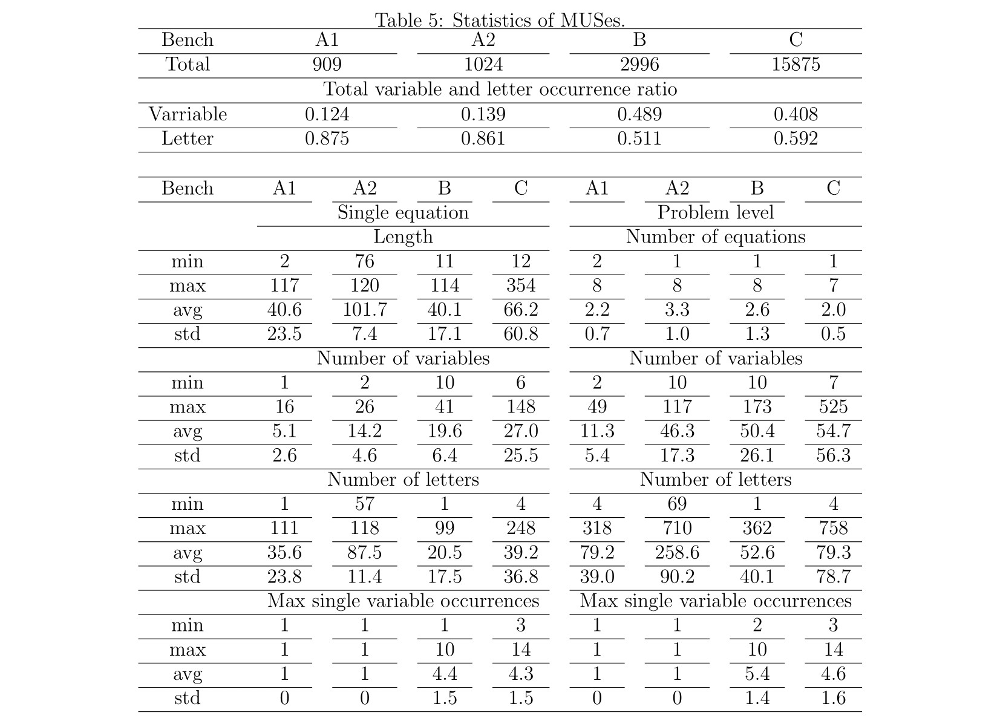

## Statistics of MUSes

**Table 5** presents the statistics of equations in the MUS for each benchmark, corresponding to the row **"Have MUS"** in **Table 1**. Each conjunctive word equation is associated with one MUS.

<!-- Insert Table 1 here -->
<!-- Replace the line below with a direct Markdown table or an image if applicable -->

